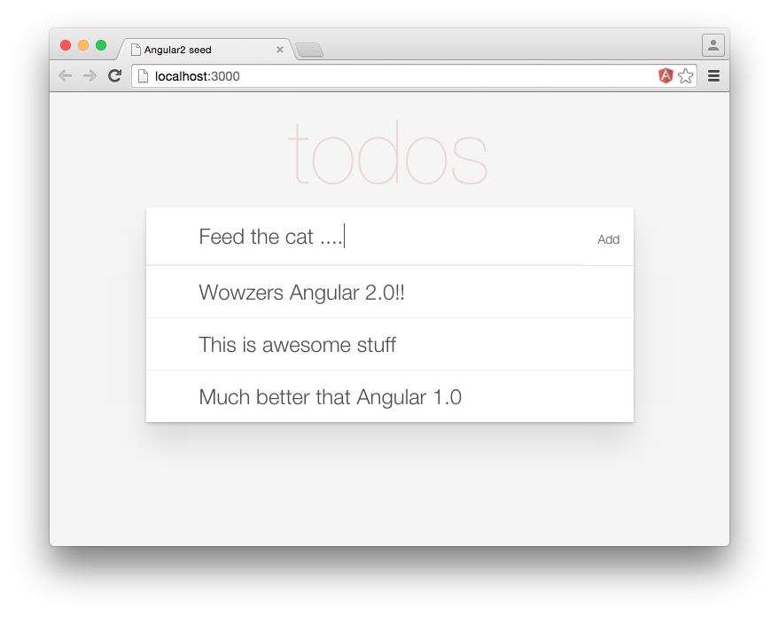

# An Angular 2.0 todo list application

**UPDATE** This project has been updated for Angular 2.0 beta

This project demonstrates a simple todo list application written with Angular 2 and TypeScript. It accompanies [a blog post I have written](http://blog.scottlogic.com/2015/12/07/angular-2.html) which describes how this application was written step-by-step. The application and blog post demonstrate the following:

 + Angular 2.0 event and property binding
 + Two-way binding
 + Dependency Injection
 + How to create components with properties and events
 + Component view encapsulation and change detection strategies
 + A flux-like approach with a store for persisting data

I have also updated the code to [show integration with Gulp, DefinitelyTyped, Immutable.js and node-uuid](http://blog.scottlogic.com/2015/12/24/creating-an-angular-2-build.html), and in a [further blog post detailed how Immutable.js and the OnPush strategy work together](http://blog.scottlogic.com/2016/01/05/angular2-with-immutablejs.html).

 
 
You can also see the application running via [GitHub pages](http://colineberhardt.github.io/angular2-todo/).

## Getting Started

 - Clone or download the repo
 - Run `npm install`
 - Run `gulp serve`

This will start a development server and launch your browser to show the application in action. For development I've been using the Atom editor with the **atom-typescript** plugin and **linter-tslint**.
